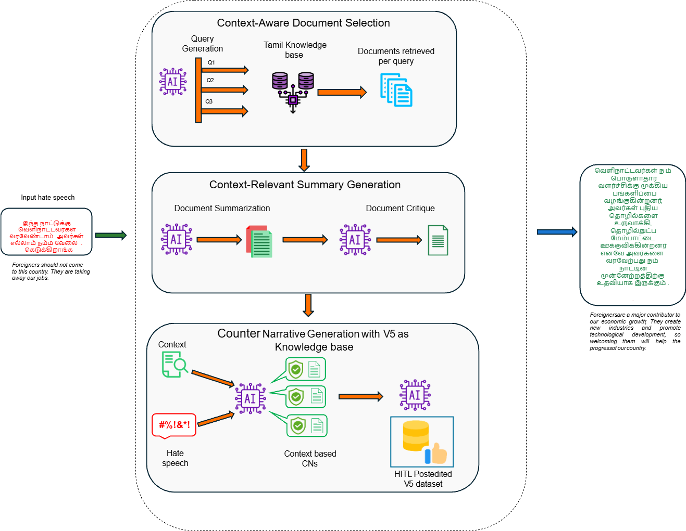
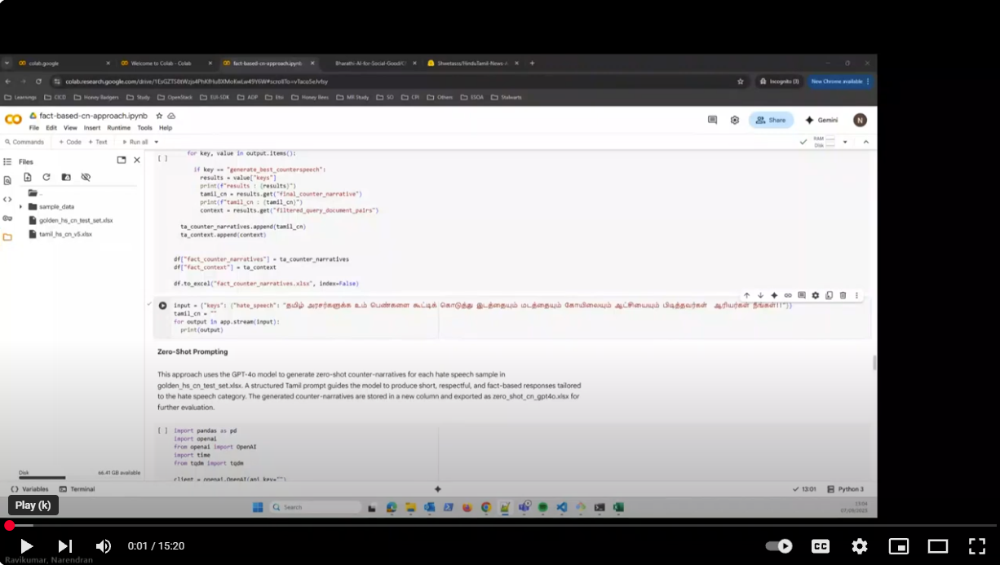

# Fact-Based Retrieval-Augmented Counter Narrative Generation for Tamil Hate Speech on Misogynistic and Xenophobic Content

This repository contains the code and experimental results for the work done on **Fact-Based Retrieval-Augmented Counter Narrative Generation for Tamil Hate Speech on Misogynistic and Xenophobic Content**

## Overview
This project addresses the challenge of generating high-quality counter-narratives (CNs) for misogynistic and xenophobic hate speech in Tamil language. Our methodologies involve in the following:

1. **Human-in-the-Loop (HITL) approach for Dataset expansion**
     - Initial seed dataset of 220 HS-CN pairs expanded to 5,000 pairs
     - Utilizes Author-Reviewer framework with voluntary human expert validation to ensure contextual relevance and linguistic quality
    
2. **Fact-based CN generation**
     - Introduces the langchain pipeline to generate CNs based on facts collected from external document
     - CNs generated with factual grounding

3. **HITL guided Fact-RAG (Proposed method)**
     - Integrates the human post-edited final dataset as a curated knowledge base within Fact-based CN generation pipeline
     - Acheives better factual grounding while maintaining performance across factuality, persuasiveness, informativeness and linguistic quality

The flow diagram of our proposed approach pipeline:

## Experiments
Experiments conducted to evaluate the dataset expansion of HS-CN paris include:
  - **Imbalance Degree** – measuring uniformity across two different hate speech categories.  
  - **Acceptance Rate (untouched & modified)** – proportion of CNs accepted without or with edits by human experts.  
  - **Discarded Pairs Rate** – proportion of rejected outputs by human experts.  
  - **HTER (Human Translation Error Rate)** – human expert editing effort required.  
  - **Repetition Rate** – repetition rates in HS and CN generated outputs.  
  - **Novelty (vs. V1, cumulative, and iteration-wise)** – lexical diversity and originality.  
  - **Vocabulary Growth** – CN vocabulary size, new and reused vocabulary.

We also benchmarked multiple LLMs like GPT-3.5, GPT-4o, Gemini, Claude and compared different approaches like zero-shot, few-shot, RAG, and Fact-RAG to determine the best performing LLM and the approach. Key evaluation metrics include:
  - **Toxicity (HS & CN)** – harmfulness in the generated HS and CN outputs.  
  - **Factuality** – factual grounding of CNs from external knowledge sources.  
  - **Persuasiveness** – ability of CNs to present convincing arguments.  
  - **Informativeness** – richness and content depth.  
  - **Linguistic Quality** – fluency and readability.  
  - **BLEU-1/2/3/4** – n-gram overlap with references.  
  - **BERTScore** – semantic similarity to references.

## Demo
)
